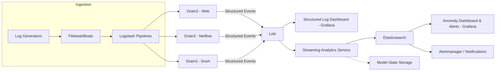
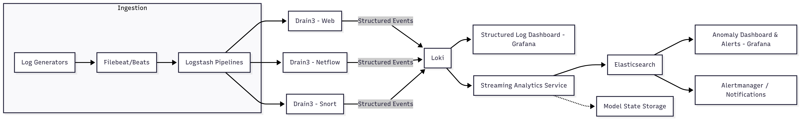

## Prototype Streaming Anomaly-Detection Platform

### Goals
- End-to-end demo of log ingestion -> template extraction -> feature engineering -> PCA-based anomaly scoring -> dashboards/alerting.
- Modular components that can be deployed independently and scale to unbounded log streams.
- Repeatable deployment via `docker-compose`, with each service (ingest, parsing, analytics, storage, viz) running in its own container.

### High-Level Flow
1. **Log generation / replay** – multiple synthetic sources (e.g., Apache web, Netflow, Snort) emit logs with controllable “attack” toggles for labelled anomalies.
2. **Beats -> Logstash** – Beats forward raw logs; Logstash enriches with source metadata (datastream labels, routing keys) and forwards to the analytics service without heavy parsing. Separate pipelines per datastream for routing only.
3. **Drain3 template extraction** – A dedicated Drain3 instance per datastream handles preprocessing (regex parsing, timestamp normalization) and template mining. Structured events (template ID + parameters) are emitted for downstream consumers.
4. **Structured log storage (Loki)** – Structured events are pushed into Loki for near real-time exploration in Grafana (per stream dashboards, recent logs, template frequency).
5. **Streaming analytics service** – Python module consumes structured events from Drain3 (already preprocessed), performs windowing, event-count matrices, incremental PCA scoring, and publishes anomaly metrics.
6. **Anomaly results storage (Elasticsearch)** – Stores window-level scores, anomaly flags, and supporting metadata for historical analysis.
7. **Grafana dashboards** – Two tiers: (a) structured-log explorer (Loki), (b) anomaly metrics (ES) with alert rules fed back into Grafana/Alertmanager.

### Component Requirements

#### Ingestion & Template Extraction
- **Beats**: lightweight shippers; one per log source. Attach source metadata (e.g., `datastream`, environment, host).
- **Logstash**: add routing labels/metadata and forward raw logs to the appropriate Drain3 service; keep pipelines simple per datastream.
- **Drain3 services**: one per datastream, responsible for preprocessing (regex parsing, timestamp normalization) and template mining. Persist miner state so templates survive restarts; emit structured events (template ID, parameters, metadata).

#### Structured Storage (Loki)
- Receive structured events with labels (`datastream`, `template_id`, etc.).
- Retain short-term history to support dashboards and debugging.

#### Streaming Analytics Service
- Consume structured events emitted by Drain3 (via Loki API, message bus, or direct stream).
- Pipeline stages:
  1. Windowing and event count matrix creation per datastream.
  2. Incremental PCA scoring (score-only mode in production; optional online re-training).
  3. Output `window_id`, `anomaly_score`, `is_anomaly`, and supporting stats.
- Maintain PCA state per stream in a persistent store (local disk, Redis, S3) to survive restarts.
- Expose health/metrics endpoint (throughput, lag, anomaly rate).

#### Anomaly Storage & Visualization
- **Elasticsearch**: stores anomaly records with indices partitioned by datastream/date. Enables historical queries and Grafana panels.
- **Grafana dashboards**:
  - Structured logs (Loki): live tail, template counts, per-stream filters.
  - Anomaly analytics (ES): time series of scores, top anomalous windows, confusion-matrix panels when labels available.
  - Configure alert rules on anomaly scores (e.g., sustained anomalies).

#### Deployment Topology
- All services orchestrated via `docker-compose`:
  - `beats-*` containers (or log replay scripts) per datastream.
  - `logstash` for lightweight routing/label enrichment to Drain3 services.
  - `drain3-*` containers (one per stream) handling preprocessing + template extraction, emitting structured events.
  - `streaming-analytics` container (windowing + PCA scoring) with volume-mounted state store.
  - `loki`, `elasticsearch`, `grafana`, `alertmanager`.
- Configuration maps datastreams to specific Drain3 instances and analytics workers (and optionally controls whether they operate in train vs score mode).

### Log Generators / Replay
- Use realistic sample corpora (e.g., Apache access logs, Netflow CSV, Snort alerts).
- Containerized replay tools (e.g., `log-generator` images or custom scripts) with parameters to inject anomalies (e.g., burst of 500 errors, simulated port scans).
- Optionally integrate attack simulators (e.g., DoS script, SQL injection) to create labelled anomalies.

### Next Steps
1. Finalize streaming analytics refactor (incremental PCA, model persistence).
2. Package the Python module as a container with CLI for `train` and `score` modes.
3. Build docker-compose stack wiring Beats -> Logstash -> Streaming Analytics -> Loki/ES -> Grafana.
4. Create initial Grafana dashboards (structured logs + anomaly analytics).
5. Document standard operating procedures (SOP) including scaling strategies, failure recovery, and adding new datastreams.
